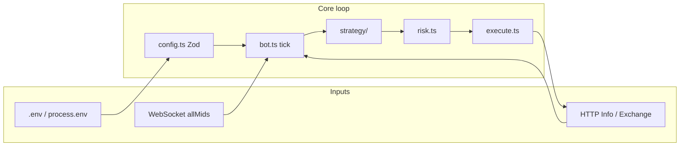

# Hyperliquid Trading Bot

> TypeScript + Node 20. Automates **Hyperliquid** perp workflows: WebSocket mids, periodic decisions, risk gates, optional signed orders via **`@nktkas/hyperliquid`** and **viem**.

**Official docs:** [Hyperliquid GitBook](https://hyperliquid.gitbook.io/hyperliquid-docs)

---

## At a glance

| Topic | Detail |
|--------|--------|
| **Language** | TypeScript (ES modules), compiled with `tsc` |
| **Entry** | `src/main.ts` → `HyperliquidBot` in `src/bot.ts` |
| **Config** | All runtime knobs from **environment variables**; validated with **Zod** in `src/config.ts` |
| **Markets** | `HL_NETWORK` + `HL_COIN`; mids from WS `allMids` |
| **Trading** | Off unless `TRADING_ENABLED` is truthy; requires `HL_PRIVATE_KEY` |
| **Strategies** | `noop` (default) or `dual_ma` (example long-only MA on mids) |

---

## Quickstart

```bash
npm install
cp .env.example .env   # Windows: copy .env.example .env
```

Edit `.env`, then:

```bash
npm run dev            # hot reload via tsx
# or
npm run build && npm start
```

Use **`HL_NETWORK=testnet`** while you iterate. Treat `dual_ma` as **demo logic**, not a production alpha.

---

## Architecture



Each **tick** (`TICK_INTERVAL_MS`): read latest mid → update mid history → (if wallet known) fetch clearinghouse → strategy decision → optional risk layer → optional `exchange.order(...)`. Ticks **do not overlap**; if one tick is still running, the next scheduled tick is skipped with a warning.

With **`TRADING_ENABLED=true`**, startup also runs **`updateLeverage`** (`HL_LEVERAGE`, `HL_CROSS_MARGIN`), clamped to the asset’s max leverage from metadata.

---

## Configuration reference

Every variable below is read from the environment (see `loadConfig()` in `src/config.ts`). Invalid combinations fail fast with a clear error (for example: trading on without a private key, or `DUAL_MA_SLOW` ≤ `DUAL_MA_FAST`).

### Connectivity and market

- **`HL_NETWORK`** — `mainnet` \| `testnet`
- **`HL_COIN`** — Perp name on the main DEX (e.g. `BTC`)

### Wallets and trading

- **`HL_PRIVATE_KEY`** — Optional unless `TRADING_ENABLED` is true; hex key, `0x` optional (normalized in code)
- **`HL_USER_ADDRESS`** — Optional `0x` address; used to poll clearinghouse when you are not trading, or in addition to your trading wallet where applicable
- **`TRADING_ENABLED`** — Default false; accepts `true` / `1` / `yes` / `on` (case-insensitive) to enable order submission

### Leverage and margin

- **`HL_LEVERAGE`** — Integer 1–125; capped by the coin’s maximum from the API
- **`HL_CROSS_MARGIN`** — Boolean-ish env; cross vs isolated for leverage update

### Risk and execution

- **`MAX_POSITION_USD`** — Approximate cap on absolute position notional (uses mid)
- **`ORDER_NOTIONAL_USD`** — Target notional per order (approximate, mid-based)
- **`ORDER_COOLDOWN_MS`** — Minimum gap between successful submits
- **`IOC_SLIPPAGE_BPS`** — IOC limit prices skewed from mid in basis points

### Strategy and loop

- **`STRATEGY`** — `noop` \| `dual_ma`
- **`DUAL_MA_FAST`**, **`DUAL_MA_SLOW`**, **`DUAL_MA_BAND_BPS`** — Only for `dual_ma`; slow window must exceed fast
- **`TICK_INTERVAL_MS`** — Loop period in ms (minimum **500**)

### Observability

- **`LOG_LEVEL`** — Default `info`; supports `trace` through `fatal` and `silent`

The template [`.env.example`](.env.example) documents the same keys inline; add `LOG_LEVEL=info` there if you want it visible in every new clone.

---

## Source map

| Path | Responsibility |
|------|------------------|
| `src/main.ts` | Load config, `setLogLevel`, construct bot, graceful shutdown on SIGINT/SIGTERM |
| `src/bot.ts` | Hyperliquid clients, mids subscription, tick orchestration |
| `src/config.ts` | Zod schema + `AppConfig` |
| `src/logger.ts` | Shared `logger` + `setLogLevel` (ISO lines on stderr) |
| `src/account.ts` | Clearinghouse parsing helpers |
| `src/risk.ts` | Cooldown, per-order notional, projected max position |
| `src/execute.ts` | Build batch order payload, call `ExchangeClient.order` |
| `src/strategy/types.ts` | `Strategy`, `StrategyContext`, `OrderIntent` |
| `src/strategy/noop.ts` | Never proposes orders |
| `src/strategy/dualMa.ts` | Example dual moving average on stored mids |
| `src/strategy/index.ts` | `createStrategy(config)` |

---

## Extending the bot

1. Add a new strategy module under `src/strategy/`, implement `Strategy`, and register it in `src/strategy/index.ts` (and in the `STRATEGY` enum in `config.ts`).
2. Keep **risk** assumptions explicit in `risk.ts` or tighten limits via env.
3. Prefer **testnet** and **`noop`** until you trust the full path from mid → intent → signed payload.

---

## Logging in code

```ts
import { logger } from "./logger.js";

logger.info("Connected");
logger.warn("Stale mid", { coin: "BTC" });
```

`main.ts` calls `setLogLevel(cfg.LOG_LEVEL)` after validation so the process and modules share one level.

---

## Security checklist

- Do not commit **`.env`** or keys.
- Use a **low-balance** or **vault-segregated** key for experiments.
- Read Hyperliquid’s latest guidance on signing, nonces, and API limits before mainnet automation.

---

## npm scripts

| Script | Command |
|--------|---------|
| `dev` | `tsx watch src/main.ts` |
| `build` | `tsc -p tsconfig.json` |
| `start` | `node dist/main.js` |
| `typecheck` | `tsc -p tsconfig.json --noEmit` |

---

## Stack (dependencies)

Runtime: **`@nktkas/hyperliquid`**, **`viem`**, **`zod`**, **`dotenv`**. Dev: **`typescript`**, **`tsx`**, **`@types/node`**.

---

## Disclaimer

Perpetual futures are **high risk**. This software is provided **as-is** for education and experimentation. You are solely responsible for capital deployed, compliance, and any losses. **Not financial advice.**
